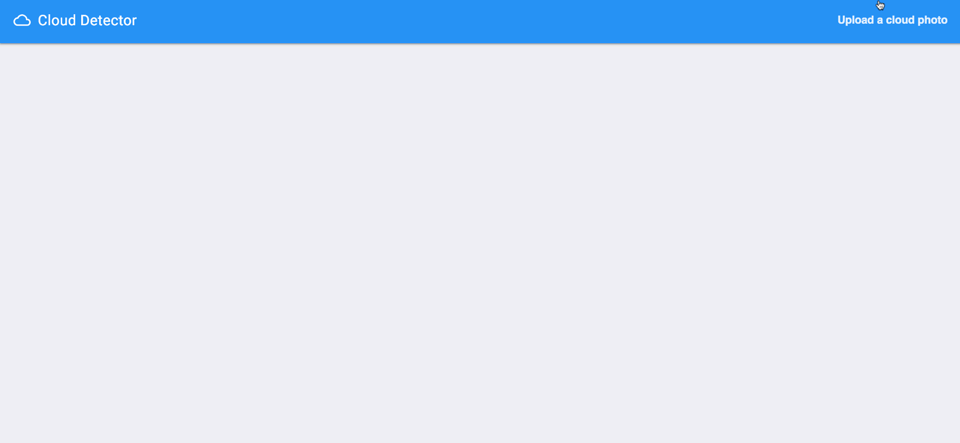
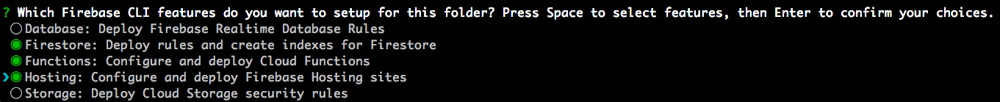
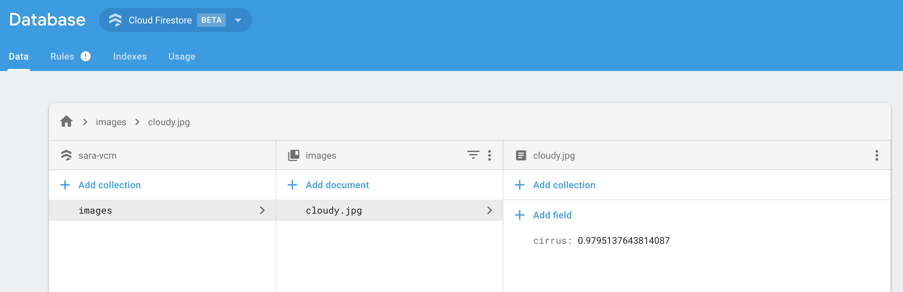
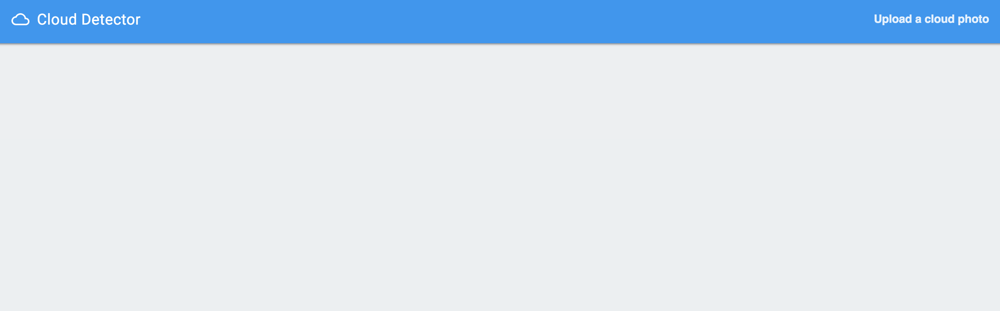

**This is not an official Google product**

# Demo: querying a custom AutoML model from a web app

This demo shows how to call a custom AutoML model from a web app using the [AutoML API](https://cloud.google.com/vision/automl/docs/reference/rest/). It queries an [AutoML Vision](https://cloud.google.com/vision/automl/docs/) model, but the code can easily be adapted for [AutoML Natural Language](https://cloud.google.com/natural-language/automl/docs/) since the API is the same for both. The model I'm using for this predicts the type of cloud in an image:



*For more details on this specific vision model, check out the AutoML section of my [Cloud Next '18 talk](https://youtu.be/QU7_eU8HzAQ?t=16m12s).*

## Pre-requisites

* You've built and trained a model with [Cloud AutoML](http://cloud.google.com/automl). 
* You've enabled the AutoML API in your Cloud project
* You've created a project in the Firebase console and associated it with the same project where you trained your AutoML model. Using the [Firebase CLI](https://firebase.google.com/docs/cli/), make sure to initialize your project with Firestore, Functions, Hosting, and Storage:



## Deploying the function

From within the `functions/` directory, run `npm install` to install the Node packages listed in `functions/package.json`. The `functions/index.js` file includes the functions code to call the custom AutoML model. 

First, replace the 3 placeholder strings at the top of the file with  info for your own project and AutoML model:

```javascript
const project = 'YOUR_PROJECT_NAME';
const region = 'YOUR_PROJECT_REGION';
const automl_model = 'YOUR_AUTOML_MODEL_ID';
```

Now you're ready to deploy the function. From the root directory of this project, run the command:

```bash
firebase deploy --only functions
```

Once your function deploys successfully you can test it by uploading a photo to the Firebase Storage bucket in your project. Then check your Firestore database. You should see the prediction data for that image:



## Deploying the frontend

The frontend code for this app is all in the `public/` directory and uses good old jQuery :) In `public/main.js`, a photo is uploaded to the Firebase Storage bucket for your project which triggers the function calling the AutoML API. First, try it out by serving the frontend locally. Run `firebase serve` from the root directory of this project, navigate to `localhost:5000`, and you should see this:



If the frontend is working correctly you're ready to deploy it. Run the command:

```bash
firebase deploy --only hosting
```

Now your app should be deployed to a firebaseapp.com domain, woohoo!